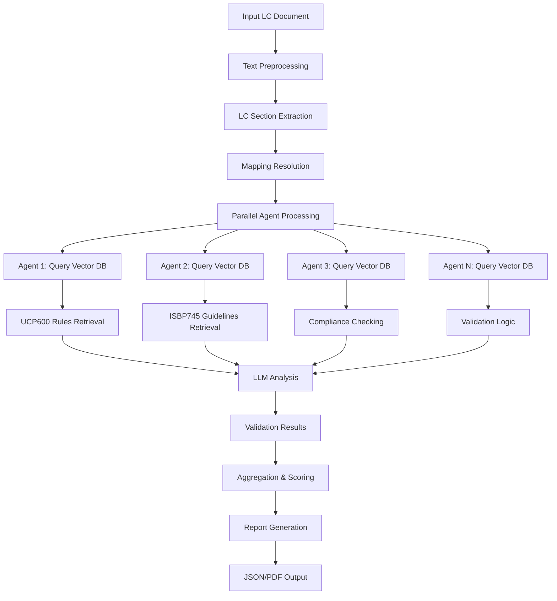

# LC Validation System - Data Flow

```mermaid

graph TD
    A[Input LC Document] --> B[Text Preprocessing]
    B --> C[LC Section Extraction]
    C --> D[Mapping Resolution]

    D --> E[Parallel Agent Processing]

    E --> F1[Agent 1: Query Vector DB]
    E --> F2[Agent 2: Query Vector DB]  
    E --> F3[Agent 3: Query Vector DB]
    E --> F4[Agent N: Query Vector DB]

    F1 --> G1[UCP600 Rules Retrieval]
    F2 --> G2[ISBP745 Guidelines Retrieval]
    F3 --> G3[Compliance Checking]
    F4 --> G4[Validation Logic]

    G1 --> H[LLM Analysis]
    G2 --> H
    G3 --> H
    G4 --> H

    H --> I[Validation Results]
    I --> J[Aggregation & Scoring]
    J --> K[Report Generation]
    K --> L[JSON/PDF Output]

```