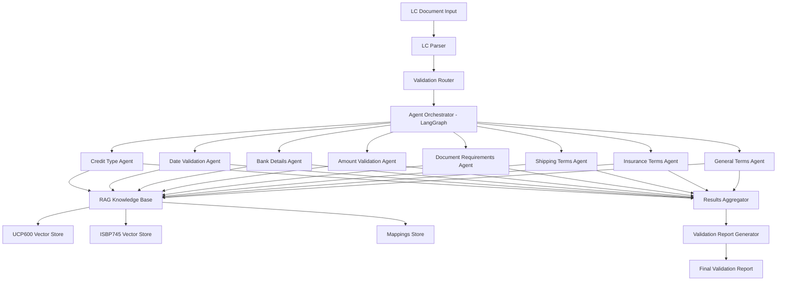

# LC Validation System - Logical Architecture

```mermaid

graph TD
    A[LC Document Input] --> B[LC Parser]
    B --> C[Validation Router]
    C --> D[Agent Orchestrator - LangGraph]

    D --> E1[Credit Type Agent]
    D --> E2[Date Validation Agent]
    D --> E3[Bank Details Agent]
    D --> E4[Amount Validation Agent]
    D --> E5[Document Requirements Agent]
    D --> E6[Shipping Terms Agent]
    D --> E7[Insurance Terms Agent]
    D --> E8[General Terms Agent]

    E1 --> F[RAG Knowledge Base]
    E2 --> F
    E3 --> F
    E4 --> F
    E5 --> F
    E6 --> F
    E7 --> F
    E8 --> F

    F --> G1[UCP600 Vector Store]
    F --> G2[ISBP745 Vector Store]
    F --> G3[Mappings Store]

    E1 --> H[Results Aggregator]
    E2 --> H
    E3 --> H
    E4 --> H
    E5 --> H
    E6 --> H
    E7 --> H
    E8 --> H

    H --> I[Validation Report Generator]
    I --> J[Final Validation Report]

```