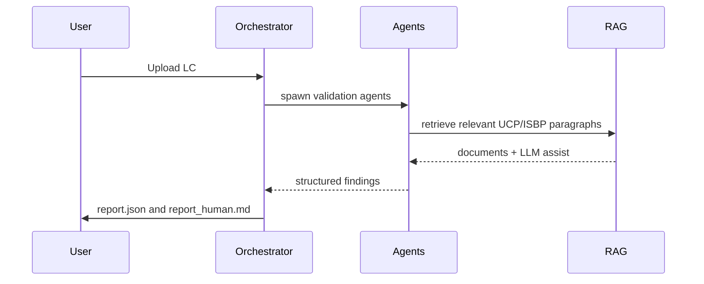

# Architecture & Data Flow (Mermaid)

## Architecture
```mermaid
flowchart TD
  A[Input: LC document (text/PDF)] --> B[Preprocessor: text extraction, normalization]
  B --> C[Sectionizer: split LC into structured fields]
  C --> D[Validator Agent Orchestrator]
  D -->|parallel| E1[Document Rules Agent]
  D -->|parallel| E2[Trade Terms Agent]
  D -->|parallel| E3[Transport & B/L Agent]
  D -->|parallel| E4[Insurance Agent]
  D -->|parallel| E5[Date & Timelines Agent]
  E1 --> F[RAG Retriever + LLM] 
  E2 --> F
  E3 --> F
  E4 --> F
  E5 --> F
  F --> G[Vector Store (Chroma)] 
  G --> H[Embeddings Service]
  F --> I[LLM (gpt4o / other)]
  I --> J[Validation Synthesis & Explanation]
  J --> K[Validation Report (JSON + Human)]
```

## Data Flow (sequence)

